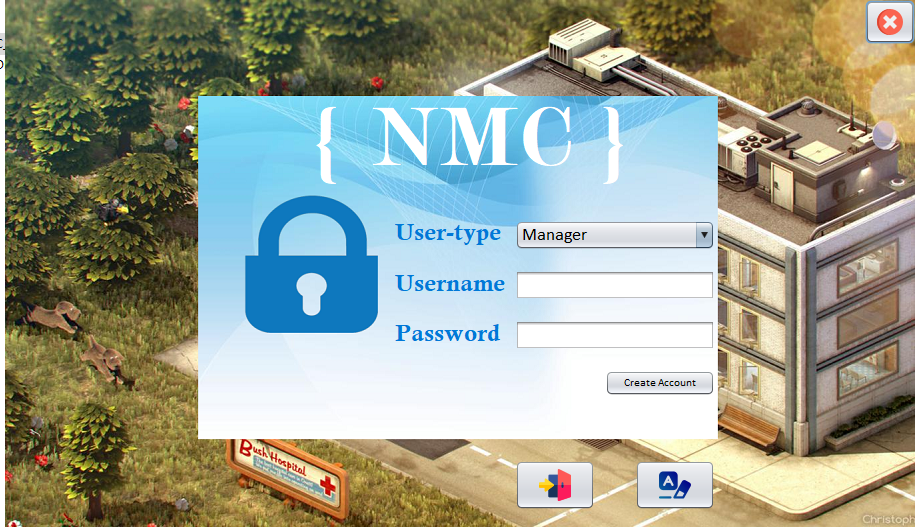

# Nust-Medical-Center
NMC is a Desktop App build using JFrame and MySQL Database. Basically it can manages all the activities perform in the  Medical center for students.

# Features
Some of the features are mention here:
- Patient Management
- Appointment Scheduling
- Patient Records
- Prescription Management
- Custom Reports
- Inventory Management
- Doctor Management

# Preview

